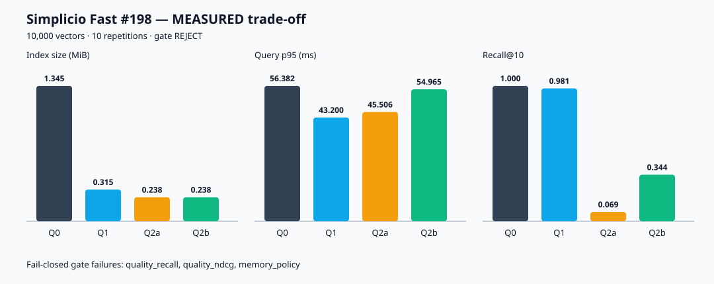

# Quant benchmark Q0/Q1/Q2 — issue #198

- Classification: `MEASURED`
- Source commit: `620e1a3632a60cddecb41bbeb7a13fd477d5f930`
- Config hash: `95728254b2721f25c66f8e2fb9d3fe6f89a32fa3e88ea0eaa6f92df5e4fca0a7`
- Generation: `53a79e0b4e29880a691a39a3f64f55460d06a28cad4bbebb69556ca826a2529a`
- Reproduction: `PYTHONPATH=src python benchmarks/quant_benchmark_198.py --repetitions 10 --max-vectors 10000`
- Rust parity: `null` (`RUNTIME_FAST_QUANT_CAPABILITY_UNAVAILABLE`); no Rust compilation was attempted.



Measured lanes use identical corpus, queries, judgments, embeddings and configuration.
Q2a is 4-bit without reranking; Q2b reranks its candidates with integral vectors.

## 10,000 vectors

Dataset: `62e2e7a1315727c2aae27db671e84e355d5c8bd2282a6eceb9dff51ecc585802`

Corpus: `8f95e8baeb10573468a7b148a6c4fc267c833ff62253b0412046d5175d47df4e`

Queries: `d861029d45904f180de799ddebe177ae51c51bda8a390bf128bfe83afaae6526`
Embeddings: `31c6cbcec7046af37ad7110e28de4f5bcfefbab507cbd7f94b240e46ef136ad3`

| Lane | Index bytes | Reduction | Query p50 ms | Query p95 ms | Recall@10 | nDCG@10 | Rerank p50 ms |
|---|---:|---:|---:|---:|---:|---:|---:|
| Q0 | 1,410,016 | 0.00% | 41.530 | 49.756 | 1.0000 | 1.0000 | 0.000 |
| Q1 | 330,016 | 76.59% | 34.419 | 45.835 | 0.9812 | 0.9871 | 0.000 |
| Q2a | 250,024 | 82.27% | 37.068 | 45.819 | 0.0688 | 0.0618 | 0.000 |
| Q2b | 250,024 | 82.27% | 38.732 | 50.903 | 0.3438 | 0.4817 | 0.374 |

Promotion gate: **REJECT** (fail-closed).

```json
{
  "checks": {
    "latency": true,
    "measured_only": true,
    "memory_index": true,
    "quality_ndcg": false,
    "quality_recall": false,
    "rerank_present": true
  },
  "decision": "REJECT",
  "fail_closed": true,
  "observed": {
    "index_reduction": 0.8226800263259424,
    "ndcg_at_10_regression": 0.518311222064248,
    "query_p95_latency_ratio": 1.0230410202751516,
    "recall_at_10_regression": 0.65625
  },
  "schema": "simplicio.fast.quant-promotion-gate/v1",
  "thresholds": {
    "max_ndcg_regression": 0.02,
    "max_recall_regression": 0.02,
    "maximum_latency_ratio": 1.5,
    "minimum_index_reduction": 0.5
  }
}
```

## Unavailable sizes

Unexecuted sizes have `null` values and stable reasons; no projection is substituted for a measurement.

| Vectors | Value | Reason |
|---:|---:|---|
| 100,000 | null | `CAPACITY_LIMIT_CONFIGURED` |
| 1,000,000 | null | `CAPACITY_LIMIT_CONFIGURED` |

## Classification boundary

- `measured`: raw samples from this machine, at least ten repetitions per lane.
- `simulated`: `null`; simulations were not run or mixed into rankings.
- Claims about speed or memory are restricted to measured samples in the JSON.
- Current-RSS values may be `null` with a reason on hosts without `/proc`; index bytes, page faults, I/O blocks and peak RSS remain independently reported.
